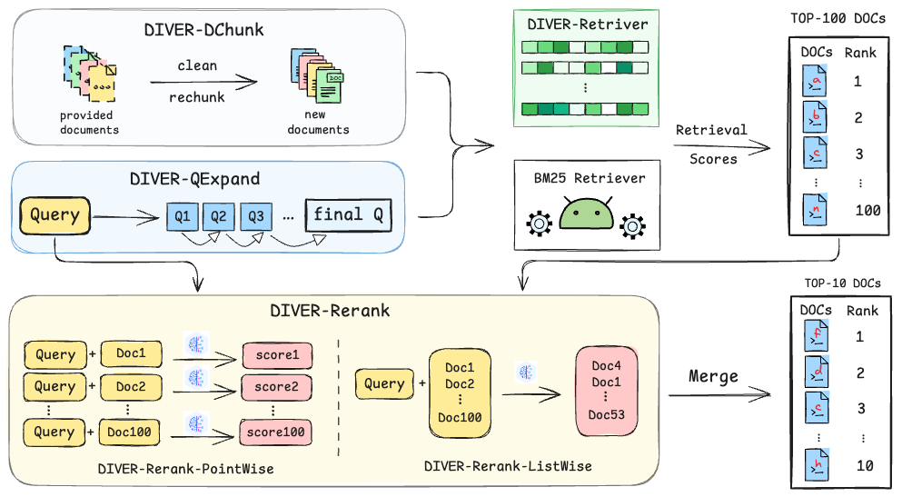

# DIVER: A Multi-Stage Approach for Reasoning-intensive Information Retrieval
【📖 [arXiv](https://arxiv.org/pdf/2508.07995) | 🤗 [HF Papers](https://huggingface.co/papers/2508.07995) | 🚀 [Diver Models](https://huggingface.co/AQ-MedAI/Diver-Retriever-4B)】

While retrieval-augmented generation (RAG) excels at direct knowledge retrieval, it falters on complex queries that require abstract or multi-step reasoning. To bridge this gap, we developed **DIVER**, a retrieval pipeline engineered for these reasoning-intensive tasks.
DIVER integrates four stages: document pre-processing, iterative LLM-driven query expansion, a specialized retriever fine-tuned on complex synthetic data, and a novel reranker that merges retrieval scores with LLM-generated helpfulness ratings. 
On the [BRIGHT benchmark](https://brightbenchmark.github.io/), DIVER sets a new state-of-the-art, significantly outperforming other reasoning-aware models (**NDCG 45.8**). These results underscore the effectiveness of integrating deep reasoning into retrieval for solving complex, real-world problems.
More details can be seen at [Diver paper](https://arxiv.org/abs/2508.07995).



## Key Features

1.LLM-Driven Query Expansion: Intelligently refines the search query.

2.Reasoning-Enhanced Retriever: A fine-tuned model that understands complex relationships.

3.Merged Reranker: Combines traditional search scores with LLM-based "helpfulness" scores for superior ranking.

## 🎉 Update
- [2025-08-24] 🚀 We realeased our Diver V2, which reaches 45.8 on [Bright Leaderboard](https://brightbenchmark.github.io/).
- [2025-08-18] 🚀 We released our full codebase, including inference and SFT training.

## Model Downloads

You can download the following table to see the various parameters for your use case. If you are located in mainland China, we also provide the model on ModelScope.cn to speed up the download process.


|      **Model**       | **#Total Params** | **Context Length** |                                                                        **Download**                                                                        |
| :------------------: | :---------------: | :----------------: | :--------------------------------------------------------------------------------------------------------------------------------------------------------: |
|    DIVER-Retriver-4B    |       4B       |        40K         |     [🤗 HuggingFace]https://huggingface.co/AQ-MedAI/Diver-Retriever-4B <br>[🤖 ModelScope]     |


## Evaluation

### Overall Evaluation

**Performance comparisons with competitive baselines on the BRIGHT leaderboard. The best result for each dataset is highlighted in bold.**

| Method | Avg. | Bio. | Earth. | Econ. | Psy. | Rob. | Stack. | Sus. | Leet. | Pony | AoPS | TheoQ. | TheoT. |
| :--- | :--- | :--- | :--- | :--- | :--- | :--- | :--- | :--- | :--- | :--- | :--- | :--- | :--- |
| Rank-R1-14B | 20.5 | 31.2 | 38.5 | 21.2 | 26.4 | 22.6 | 18.9 | 27.5 | 9.2 | 20.2 | 9.7 | 11.9 | 9.2 |
| Qwen1.5-7B with InteRank-3B | 27.4 | 51.2 | 51.4 | 22.4 | 31.9 | 17.3 | 26.6 | 22.4 | 24.5 | 23.1 | 13.5 | 19.3 | 25.5 |
| GPT4 with Rank1-32B | 29.4 | 49.7 | 35.8 | 22.0 | 37.5 | 22.5 | 21.7 | 35.0 | 18.8 | 32.5 | 10.8 | 22.9 | 43.7 |
| ReasonIR with QwenRerank | 36.9 | 58.2 | 53.2 | 32.0 | 43.6 | 28.8 | 37.6 | 36.0 | 33.2 | 34.8 | 7.9 | 32.6 | 45.0 |
| ReasonIR with Rank-R1-32B | 38.8 | 59.5 | 55.1 | 37.9 | 52.7 | 30.0 | 39.3 | 45.1 | 32.1 | 17.1 | 10.7 | 40.4 | 45.6 |
| RaDeR with QwenRerank | 39.2 | 58.0 | 59.2 | 33.0 | 49.4 | 31.8 | 39.0 | 36.4 | 33.5 | 33.3 | 10.8 | 34.2 | 51.6 |
| XRR2 | 40.3 | 63.1 | 55.4 | 38.5 | 52.9 | 37.1 | 38.2 | 44.6 | 21.9 | 35.0 | 15.7 | 34.4 | 46.2 |
| ReasonRank | 40.8 | 62.72 | 55.53 | 36.7 | 54.64 | 35.69 | 38.03 | 44.81 | 29.46 | 25.56 | 14.38 | 41.99 | 50.06 |
| **DIVER** | 41.6 | 62.2 | 58.7 | 34.4 | 52.9 | 35.6 | 36.5 | 42.9 | **38.9** | 25.4 | 18.3 | 40.0 | 53.1 |
| BGE Reasoner | 45.2 | 66.5 | **63.7** | 39.4 | 50.3 | 37 | 42.9 | 43.7 | 35.1 | **44.3** | 17.2 | 44.2 | **58.5** |
| **DIVER V2** | **45.8** | **68** | 62.5 | **42.0** | **58.2** | **41.5** | **44.3** | **49.2** | 34.8 | 32.9 | **19.1** | **44.3** | 52.6 |


### Diver Retriver Evaluation

<table>
<thead>
    <tr>
        <th>Method</th>
        <th style="text-align:right">Avg.</th>
        <th style="text-align:right">Bio.</th>
        <th style="text-align:right">Earth.</th>
        <th style="text-align:right">Econ.</th>
        <th style="text-align:right">Psy.</th>
        <th style="text-align:right">Rob.</th>
        <th style="text-align:right">Stack.</th>
        <th style="text-align:right">Sus.</th>
        <th style="text-align:right">Leet.</th>
        <th style="text-align:right">Pony</th>
        <th style="text-align:right">AoPS</th>
        <th style="text-align:right">TheoQ.</th>
        <th style="text-align:right">TheoT.</th>
    </tr>
</thead>
<tbody>
    <tr>
        <td colspan=12 style="text-align:center"><strong>Evaluate Retriever with Original Query</strong></td>
    </tr>
    <tr>
        <td>BM25</td>
        <td style="text-align:right">14.5</td>
        <td style="text-align:right">18.9</td>
        <td style="text-align:right">27.2</td>
        <td style="text-align:right">14.9</td>
        <td style="text-align:right">12.5</td>
        <td style="text-align:right">13.6</td>
        <td style="text-align:right">18.4</td>
        <td style="text-align:right">15.0</td>
        <td style="text-align:right">24.4</td>
        <td style="text-align:right">7.9</td>
        <td style="text-align:right">6.2</td>
        <td style="text-align:right">10.4</td>
        <td style="text-align:right">4.9</td>
    </tr>
    <tr>
        <td>SBERT</td>
        <td style="text-align:right">14.9</td>
        <td style="text-align:right">15.1</td>
        <td style="text-align:right">20.4</td>
        <td style="text-align:right">16.6</td>
        <td style="text-align:right">22.7</td>
        <td style="text-align:right">8.2</td>
        <td style="text-align:right">11.0</td>
        <td style="text-align:right">15.3</td>
        <td style="text-align:right">26.4</td>
        <td style="text-align:right">7.0</td>
        <td style="text-align:right">5.3</td>
        <td style="text-align:right">20.0</td>
        <td style="text-align:right">10.8</td>
    </tr>
    <tr>
        <td>gte-Qwen1.5-7B</td>
        <td style="text-align:right">22.5</td>
        <td style="text-align:right">30.6</td>
        <td style="text-align:right">36.4</td>
        <td style="text-align:right">17.8</td>
        <td style="text-align:right">24.6</td>
        <td style="text-align:right">13.2</td>
        <td style="text-align:right">22.2</td>
        <td style="text-align:right">14.8</td>
        <td style="text-align:right">25.5</td>
        <td style="text-align:right">9.9</td>
        <td style="text-align:right">14.4</td>
        <td style="text-align:right">27.8</td>
        <td style="text-align:right">32.9</td>
    </tr>
    <tr>
        <td>Qwen3-4B</td>
        <td style="text-align:right">5.6</td>
        <td style="text-align:right">3.5</td>
        <td style="text-align:right">8.0</td>
        <td style="text-align:right">2.3</td>
        <td style="text-align:right">2.0</td>
        <td style="text-align:right">1.6</td>
        <td style="text-align:right">1.0</td>
        <td style="text-align:right">4.4</td>
        <td style="text-align:right">2.1</td>
        <td style="text-align:right">0.1</td>
        <td style="text-align:right">4.9</td>
        <td style="text-align:right">18.0</td>
        <td style="text-align:right">19.2</td>
    </tr>
    <tr>
        <td>OpenAI</td>
        <td style="text-align:right">17.9</td>
        <td style="text-align:right">23.3</td>
        <td style="text-align:right">26.7</td>
        <td style="text-align:right">19.5</td>
        <td style="text-align:right">27.6</td>
        <td style="text-align:right">12.8</td>
        <td style="text-align:right">14.3</td>
        <td style="text-align:right">20.5</td>
        <td style="text-align:right">23.6</td>
        <td style="text-align:right">2.4</td>
        <td style="text-align:right">8.5</td>
        <td style="text-align:right">23.5</td>
        <td style="text-align:right">11.7</td>
    </tr>
    <tr>
        <td>Google</td>
        <td style="text-align:right">20.0</td>
        <td style="text-align:right">22.7</td>
        <td style="text-align:right">34.8</td>
        <td style="text-align:right">19.6</td>
        <td style="text-align:right">27.8</td>
        <td style="text-align:right">15.7</td>
        <td style="text-align:right">20.1</td>
        <td style="text-align:right">17.1</td>
        <td style="text-align:right">29.6</td>
        <td style="text-align:right">3.6</td>
        <td style="text-align:right">9.3</td>
        <td style="text-align:right">23.8</td>
        <td style="text-align:right">15.9</td>
    </tr>
    <tr>
        <td>ReasonIR-8B</td>
        <td style="text-align:right">24.4</td>
        <td style="text-align:right">26.2</td>
        <td style="text-align:right">31.4</td>
        <td style="text-align:right">23.3</td>
        <td style="text-align:right">30.0</td>
        <td style="text-align:right">18.0</td>
        <td style="text-align:right"><strong>23.9</strong></td>
        <td style="text-align:right">20.5</td>
        <td style="text-align:right">35.0</td>
        <td style="text-align:right">10.5</td>
        <td style="text-align:right"><strong>14.7</strong></td>
        <td style="text-align:right">31.9</td>
        <td style="text-align:right">27.2</td>
    </tr>
    <tr>
        <td>RaDeR-7B</td>
        <td style="text-align:right">25.5</td>
        <td style="text-align:right">34.6</td>
        <td style="text-align:right">38.9</td>
        <td style="text-align:right">22.1</td>
        <td style="text-align:right">33.0</td>
        <td style="text-align:right">14.8</td>
        <td style="text-align:right">22.5</td>
        <td style="text-align:right">23.7</td>
        <td style="text-align:right">37.3</td>
        <td style="text-align:right">5.0</td>
        <td style="text-align:right">10.2</td>
        <td style="text-align:right">28.4</td>
        <td style="text-align:right">35.1</td>
    </tr>
    <tr>
        <td>Seed1.5-Embedding</td>
        <td style="text-align:right">27.2</td>
        <td style="text-align:right">34.8</td>
        <td style="text-align:right"><strong>46.9</strong></td>
        <td style="text-align:right"><strong>23.4</strong></td>
        <td style="text-align:right">31.6</td>
        <td style="text-align:right">19.1</td>
        <td style="text-align:right">25.4</td>
        <td style="text-align:right">21.0</td>
        <td style="text-align:right"><strong>43.2</strong></td>
        <td style="text-align:right">4.9</td>
        <td style="text-align:right">12.2</td>
        <td style="text-align:right">33.3</td>
        <td style="text-align:right">30.5</td>
    </tr>
    <tr>
        <td>DIVER-Retriever</td>
        <td style="text-align:right"><strong>28.9</strong></td>
        <td style="text-align:right"><strong>41.8</strong></td>
        <td style="text-align:right">43.7</td>
        <td style="text-align:right">21.7</td>
        <td style="text-align:right"><strong>35.3</strong></td>
        <td style="text-align:right"><strong>21.0</strong></td>
        <td style="text-align:right">21.2</td>
        <td style="text-align:right"><strong>25.1</strong></td>
        <td style="text-align:right">37.6</td>
        <td style="text-align:right"><strong>13.2</strong></td>
        <td style="text-align:right">10.7</td>
        <td style="text-align:right"><strong>38.4</strong></td>
        <td style="text-align:right"><strong>37.3</strong></td>
    </tr>
    <tr>
        <td colspan=12 style="text-align:center"><strong>Evaluate Retriever with GPT-4 REASON-query</strong></td>
    </tr>
    <tr>
        <td>BM25</td>
        <td style="text-align:right">27.0</td>
        <td style="text-align:right"><strong>53.6</strong></td>
        <td style="text-align:right"><strong>54.1</strong></td>
        <td style="text-align:right">24.3</td>
        <td style="text-align:right">38.7</td>
        <td style="text-align:right">18.9</td>
        <td style="text-align:right">27.7</td>
        <td style="text-align:right">26.3</td>
        <td style="text-align:right">19.3</td>
        <td style="text-align:right">17.6</td>
        <td style="text-align:right">3.9</td>
        <td style="text-align:right">19.2</td>
        <td style="text-align:right">20.8</td>
    </tr>
    <tr>
        <td>SBERT</td>
        <td style="text-align:right">17.8</td>
        <td style="text-align:right">18.5</td>
        <td style="text-align:right">26.3</td>
        <td style="text-align:right">17.5</td>
        <td style="text-align:right">27.2</td>
        <td style="text-align:right">8.8</td>
        <td style="text-align:right">11.8</td>
        <td style="text-align:right">17.5</td>
        <td style="text-align:right">24.3</td>
        <td style="text-align:right">10.3</td>
        <td style="text-align:right">5.0</td>
        <td style="text-align:right">22.3</td>
        <td style="text-align:right">23.5</td>
    </tr>
    <tr>
        <td>gte-Qwen1.5-7B</td>
        <td style="text-align:right">24.8</td>
        <td style="text-align:right">35.5</td>
        <td style="text-align:right">43.1</td>
        <td style="text-align:right">24.3</td>
        <td style="text-align:right">34.3</td>
        <td style="text-align:right">15.4</td>
        <td style="text-align:right">22.9</td>
        <td style="text-align:right">23.9</td>
        <td style="text-align:right">25.4</td>
        <td style="text-align:right">5.2</td>
        <td style="text-align:right">4.6</td>
        <td style="text-align:right">28.7</td>
        <td style="text-align:right">34.6</td>
    </tr>
    <tr>
        <td>Qwen3-4B</td>
        <td style="text-align:right">5.5</td>
        <td style="text-align:right">1.3</td>
        <td style="text-align:right">17.3</td>
        <td style="text-align:right">2.5</td>
        <td style="text-align:right">6.2</td>
        <td style="text-align:right">1.0</td>
        <td style="text-align:right">4.8</td>
        <td style="text-align:right">4.5</td>
        <td style="text-align:right">3.0</td>
        <td style="text-align:right">5.9</td>
        <td style="text-align:right">0.0</td>
        <td style="text-align:right">7.2</td>
        <td style="text-align:right">12.5</td>
    </tr>
    <tr>
        <td>OpenAI</td>
        <td style="text-align:right">23.3</td>
        <td style="text-align:right">35.2</td>
        <td style="text-align:right">40.1</td>
        <td style="text-align:right">25.1</td>
        <td style="text-align:right">38.0</td>
        <td style="text-align:right">13.6</td>
        <td style="text-align:right">18.2</td>
        <td style="text-align:right">24.2</td>
        <td style="text-align:right">24.5</td>
        <td style="text-align:right">6.5</td>
        <td style="text-align:right">7.7</td>
        <td style="text-align:right">22.9</td>
        <td style="text-align:right">23.8</td>
    </tr>
    <tr>
        <td>Google</td>
        <td style="text-align:right">26.2</td>
        <td style="text-align:right">36.4</td>
        <td style="text-align:right">45.6</td>
        <td style="text-align:right">25.6</td>
        <td style="text-align:right">38.2</td>
        <td style="text-align:right">18.7</td>
        <td style="text-align:right"><strong>29.5</strong></td>
        <td style="text-align:right">17.9</td>
        <td style="text-align:right">31.1</td>
        <td style="text-align:right">3.7</td>
        <td style="text-align:right">10.0</td>
        <td style="text-align:right">27.8</td>
        <td style="text-align:right">30.4</td>
    </tr>
    <tr>
        <td>ReasonIR-8B</td>
        <td style="text-align:right">29.9</td>
        <td style="text-align:right">43.6</td>
        <td style="text-align:right">42.9</td>
        <td style="text-align:right"><strong>32.7</strong></td>
        <td style="text-align:right">38.8</td>
        <td style="text-align:right">20.9</td>
        <td style="text-align:right">25.8</td>
        <td style="text-align:right"><strong>27.5</strong></td>
        <td style="text-align:right">31.5</td>
        <td style="text-align:right"><strong>19.6</strong></td>
        <td style="text-align:right">7.4</td>
        <td style="text-align:right">33.1</td>
        <td style="text-align:right">35.7</td>
    </tr>
    <tr>
        <td>RaDeR-7B</td>
        <td style="text-align:right">29.2</td>
        <td style="text-align:right">36.1</td>
        <td style="text-align:right">42.9</td>
        <td style="text-align:right">25.2</td>
        <td style="text-align:right">37.9</td>
        <td style="text-align:right">16.6</td>
        <td style="text-align:right">27.4</td>
        <td style="text-align:right">25.0</td>
        <td style="text-align:right"><strong>34.8</strong></td>
        <td style="text-align:right">11.9</td>
        <td style="text-align:right"><strong>12.0</strong></td>
        <td style="text-align:right">37.7</td>
        <td style="text-align:right"><strong>43.4</strong></td>
    </tr>
    <tr>
        <td>DIVER-Retriever</td>
        <td style="text-align:right"><strong>32.1</strong></td>
        <td style="text-align:right">51.9</td>
        <td style="text-align:right">53.5</td>
        <td style="text-align:right">29.5</td>
        <td style="text-align:right"><strong>41.2</strong></td>
        <td style="text-align:right"><strong>21.4</strong></td>
        <td style="text-align:right">27.5</td>
        <td style="text-align:right">26.1</td>
        <td style="text-align:right">33.5</td>
        <td style="text-align:right">11.7</td>
        <td style="text-align:right">9.5</td>
        <td style="text-align:right"><strong>39.3</strong></td>
        <td style="text-align:right">39.7</td>
    </tr>
    <tr>
        <td colspan=12 style="text-align:center"><strong>Evaluate retriever with DIVER-QExpand query</strong></td>
    </tr>
    <tr>
        <td>ReasonIR-8B</td>
        <td style="text-align:right">32.6</td>
        <td style="text-align:right">49.4</td>
        <td style="text-align:right">44.7</td>
        <td style="text-align:right">32.4</td>
        <td style="text-align:right">44.0</td>
        <td style="text-align:right">26.6</td>
        <td style="text-align:right">31.8</td>
        <td style="text-align:right">29.0</td>
        <td style="text-align:right">32.3</td>
        <td style="text-align:right">12.8</td>
        <td style="text-align:right">9.1</td>
        <td style="text-align:right"><strong>40.7</strong></td>
        <td style="text-align:right">38.4</td>
    </tr>
    <tr>
        <td>+BM25 (Hybrid)</td>
        <td style="text-align:right">35.7</td>
        <td style="text-align:right">56.8</td>
        <td style="text-align:right">53.5</td>
        <td style="text-align:right"><strong>33.0</strong></td>
        <td style="text-align:right"><strong>48.5</strong></td>
        <td style="text-align:right"><strong>29.4</strong></td>
        <td style="text-align:right"><strong>34.2</strong></td>
        <td style="text-align:right"><strong>32.0</strong></td>
        <td style="text-align:right"><strong>35.2</strong></td>
        <td style="text-align:right">16.8</td>
        <td style="text-align:right">12.9</td>
        <td style="text-align:right">39.3</td>
        <td style="text-align:right">36.8</td>
    </tr>
    <tr>
        <td>DIVER-Retriever</td>
        <td style="text-align:right"><strong>33.9</strong></td>
        <td style="text-align:right">54.5</td>
        <td style="text-align:right">52.7</td>
        <td style="text-align:right">28.8</td>
        <td style="text-align:right">44.9</td>
        <td style="text-align:right">25.1</td>
        <td style="text-align:right">27.4</td>
        <td style="text-align:right">29.5</td>
        <td style="text-align:right">34.5</td>
        <td style="text-align:right">10.0</td>
        <td style="text-align:right">14.5</td>
        <td style="text-align:right"><strong>40.7</strong></td>
        <td style="text-align:right">44.7</td>
    </tr>
    <tr>
        <td>+BM25 (Hybrid)</td>
        <td style="text-align:right"><strong>37.2</strong></td>
        <td style="text-align:right"><strong>60.0</strong></td>
        <td style="text-align:right"><strong>55.9</strong></td>
        <td style="text-align:right">31.8</td>
        <td style="text-align:right">47.9</td>
        <td style="text-align:right">27.1</td>
        <td style="text-align:right">33.9</td>
        <td style="text-align:right">31.9</td>
        <td style="text-align:right">35.1</td>
        <td style="text-align:right"><strong>23.1</strong></td>
        <td style="text-align:right"><strong>16.8</strong></td>
        <td style="text-align:right">36.9</td>
        <td style="text-align:right"><strong>46.6</strong></td>
    </tr>
    </tbody>
</table>


## Quickstart


### Inference 

####  One-click Reproduction
```bash
sh run_all.sh
```

#### Diver Retriever Inference (Hugging Face Transformers)
Sentence Transformers Usage 
```bash
# Requires transformers>=4.51.0
# Requires sentence-transformers>=2.7.0

from sentence_transformers import SentenceTransformer

# Load the model
model = SentenceTransformer("AQ-MedAI/Diver-Retriever-4B")


# The queries and documents to embed
queries = [
    "What is the capital of China?",
    "Explain gravity",
]
documents = [
    "The capital of China is Beijing.",
    "Gravity is a force that attracts two bodies towards each other. It gives weight to physical objects and is responsible for the movement of planets around the sun.",
]

# Encode the queries and documents. Note that queries benefit from using a prompt
# Here we use the prompt called "query" stored under `model.prompts`, but you can
# also pass your own prompt via the `prompt` argument
query_embeddings = model.encode(queries, prompt_name="query")
document_embeddings = model.encode(documents)

# Compute the (cosine) similarity between the query and document embeddings
similarity = model.similarity(query_embeddings, document_embeddings)
print(similarity)

```


## Finetuning

We recommend you to use [swift](https://github.com/modelscope/ms-swift) to finetune our DIVER-Retriever-4B with infonce.

Before starting training, please ensure your environment is properly configured.

```bash
pip install ms-swift -U
# Install from source
pip install git+https://github.com/modelscope/ms-swift.git

pip install transformers -U

# Optional packages
pip install deepspeed # multi-GPU training
pip install liger-kernel # save GPU memory resources
pip install flash-attn --no-build-isolation
```

### Training Data Preparation

```json
# LLM
{"query": "sentence1", "response":  "sentence2"}
# MLLM
{"query": "<image>", "response":  "sentence", "images": "/some/images.jpg"}
{"query": "<image>sentence1", "response":  "<image>sentence2", "rejected_response": ["<image>sentence1", "<image>sentence2"], "images": ["/some/images.jpg", "/some/images.jpg", "/some/images.jpg", "/some/images.jpg"]}
```

### Training Command

Using infonce loss as an example, the complete training command is as follows:

```bash
nproc_per_node=8
NPROC_PER_NODE=$nproc_per_node \
swift sft \
    --model DIVER/DIVER-Retriever-4B \
    --task_type embedding \
    --model_type qwen3_emb \
    --train_type full \
    --dataset your_dataset \
    --split_dataset_ratio 0.05 \
    --eval_strategy steps \
    --output_dir output \
    --eval_steps 20 \
    --num_train_epochs 5 \
    --save_steps 20 \
    --per_device_train_batch_size 4 \
    --per_device_eval_batch_size 4 \
    --gradient_accumulation_steps 4 \
    --learning_rate 6e-6 \
    --loss_type infonce \
    --label_names labels \
    --dataloader_drop_last true \
    --deepspeed zero3
```


## Citation

If you find our work helpful, feel free to give us a cite.

```
@misc{DIVER,
      title={DIVER: A Multi-Stage Approach for Reasoning-intensive Information Retrieval}, 
      author={Meixiu Long and Duolin Sun and Dan Yang and Junjie Wang and Yue Shen and Jian Wang and Peng Wei and Jinjie Gu and Jiahai Wang},
      year={2025},
      eprint={2508.07995},
      archivePrefix={arXiv},
      primaryClass={cs.IR},
      url={https://arxiv.org/abs/2508.07995}, 
}
```

## Acknowledgement

We thank prior works and their open-source repositories: BRIGHT, ReasonIR, RaDer, ThinkQE.
